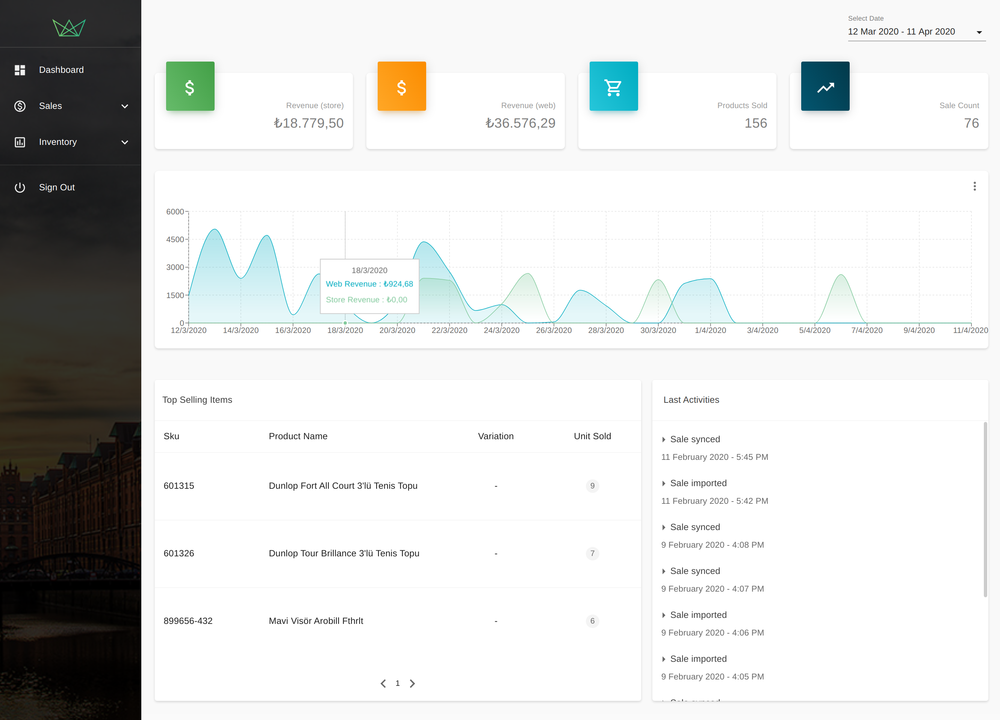

# Point of Sale App dubbed as "MyPOS App"

#### Demo 
Please kindly note that this app was meant to be used as a desktop app in stores. Nonetheless, it has been made somewhat responsive for the screens of ipad and iphone 6/7/8 devices.

Also, the app is currently using React hooks, Redux and Context API coupled with Typescript all together in order to serve the purpose showing my knowledge on all of these technologies and tools.

http://stock-management-ui-staging.s3-website.eu-central-1.amazonaws.com/

- Login Credentials 
  - email: demo@demo.com
  - password: demo

Currently I'm adding the functionality of inventory count page of which the main layout somewhat completed.

#### Pages and Features

## Sign in Page
  - Used Formik and Yup for validation purposes.
  
## Dashboard Page
  - Stacked revenue chart both for web and store revenues.
  - Stacked revenue, products sold and sale count cards that shows data in correlation with the dates selected.
  - Top selling items 
  - All of above-mentioned data can be filtered using the date filter. The default value for the date picker is last thirty(30) days. It also has default values for the cases where one of the start or end date are not selected by the user.
  - Last activities for stock management 
  
## Point of Sale / Cash Register Page
  - Search products by name, sku and barcode.
  - If searched product is not found, plus button appears which opens a dialog for adding new product.
  - New product input fields uses reusable custom input and formik as well as yup for validation.
  - Adding new product will give either success or error feedback by the reusable snackbar component.
  - The total price, tax and discount shall be calculated automatically once the product is added.
  - The price is editable with a popover and the total is calculated again on price change. 
  - Right and left arrows increases and decreases quantities respectively.
  - Totals adjust when a product is deleted or quantity is changed.
  - Discount input provides the possibility of implementing an additional discount to total price.
  - If the sale is completed successfully, there is a success feedback with a snackbar appearing.
  - Once the sale is completed, they appear in sales history. 
  - Products are coming from local storage by the help of useLocalStorageReducerState hook which is utterly reusable and can be used by any useReducer hook. 

## Sales History Page
  - Reusable Material UI Table.
  - When clicked it shows the sales details.
  - Filtering sales by start and end dates.
  - Pagination.

## Products Page
  - Reusable Material UI Table.
  - When clicked it shows product details.
  - When edit icon clicked all information for that particular product can be edited.
  - If the editing is completed successfully, there is a success feedback with a snackbar appearing.
  - Reusable edit inputs.
  - Filtering by name/sku/barcode, category or brand.
  - After applying filters, chip inputs appear in order to remove the applied filters and apply new ones.
  - Pagination.

## Inventory Count Page
 - Inventory count functionality will let them to count all of the products on their stores so that they could be in synced with their stores and e-commerce website.
